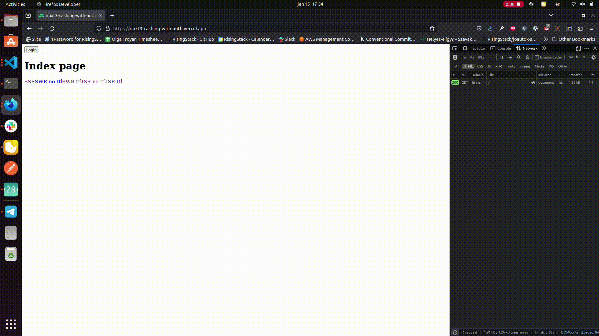
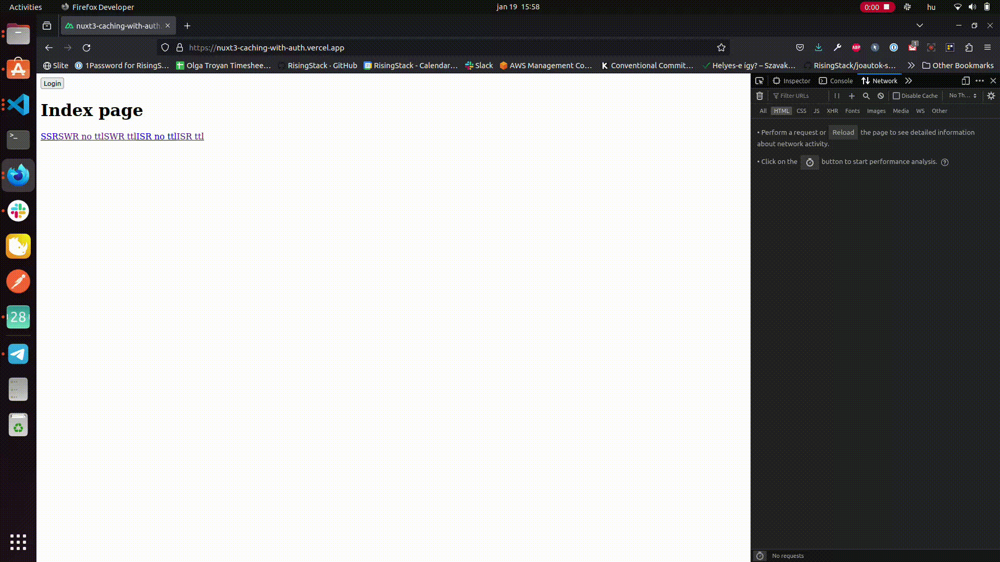
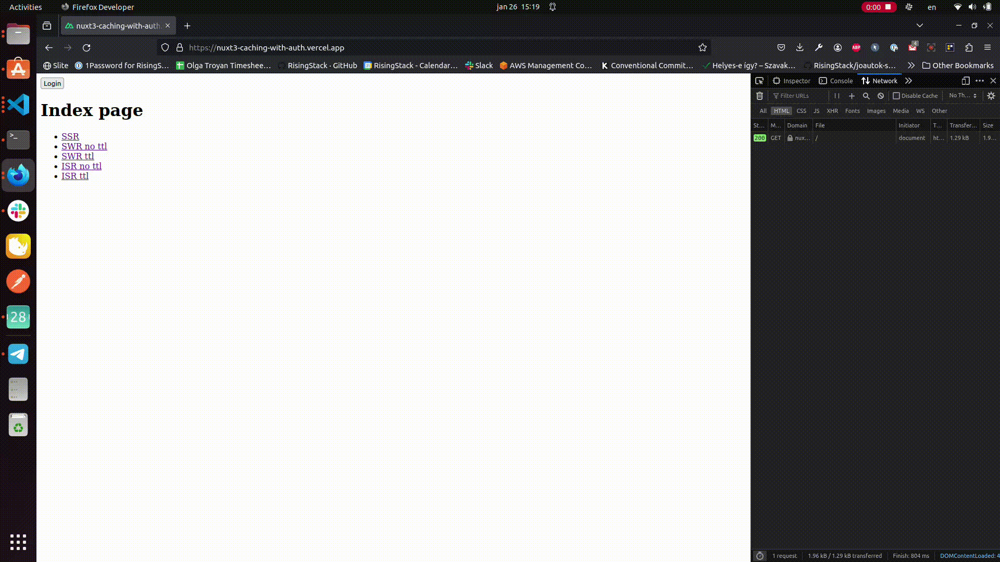
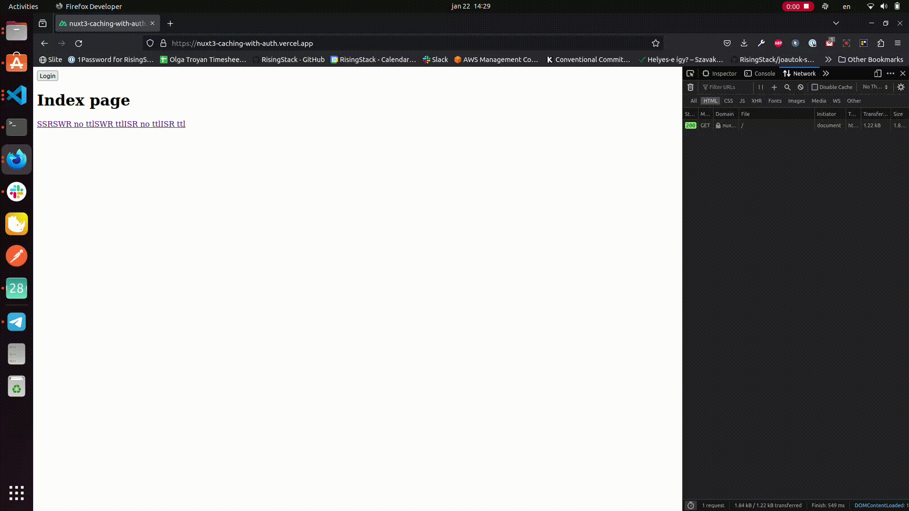

# Nuxt 3 Caching with Authentication

## Startup

Look at the [Nuxt 3 documentation](https://nuxt.com/docs/getting-started/introduction) to learn more.

### Setup

Make sure to install the dependencies:

```bash
# npm
npm install

# pnpm
pnpm install

# yarn
yarn install

# bun
bun install
```

### Development Server

Start the development server on `http://localhost:3000`:

```bash
# npm
npm run dev

# pnpm
pnpm run dev

# yarn
yarn dev

# bun
bun run dev
```

### Production

Build the application for production:

```bash
# npm
npm run build

# pnpm
pnpm run build

# yarn
yarn build

# bun
bun run build
```

Locally preview production build:

```bash
# npm
npm run preview

# pnpm
pnpm run preview

# yarn
yarn preview

# bun
bun run preview
```

Check out the [deployment documentation](https://nuxt.com/docs/getting-started/deployment) for more information.

## Story behind
We had a project where we wanted to optimize page load times while preserving the SEO benefits. One of the techniques we used was to enable ISR (incremental static regeneration) which caches the page html response on CDN network until TTL (time to live) expires. However we also had parts of the pages that were user/specific (profile, number of items etc.) which couldn't be cached otherwise one user could have seen other user's items.
That problem is what we want to provide solution for in our article.

## Project setup
### Pages
Project has 5 pages with different rendering modes enabled:
1. SSR
2. ISR without TTL
3. ISR with TTL
4. SWR without TTL
5. SWR with TTL

To learn more about rendering modes in Nuxt 3, check out our blogpost [here](https://blog.risingstack.com/nuxt-3-rendering-modes/).

[Example of page code:](pages/spa.vue)
```vue
<template>
    <div>
        <p>{{ pageType }} page</p>
        <pre>Time after hydration: {{ new Date().toUTCString() }} </pre>
        <pre>Time in server rendered HTML: {{ data }}</pre>
        <NuxtLink to="/">Home</NuxtLink>
    </div>
</template>
<script setup lang="ts">
const pageType = "SSR"; // value differs based on route
const { data } = await useFetch('/api/hello')
</script>
```

### Rendering modes
Rendering modes are set up in [nuxt.config:](nuxt.config.ts)
```javascript
export default defineNuxtConfig({
  ssr: true,
  routeRules: {
    "/isr_ttl": { isr: 60 },
    "/isr_no_ttl": { isr: true },
    "/swr_ttl": { swr: 60 },
    "/swr_no_ttl": { swr: true },
  },
});
```

### Server routes
For the purpose of this showcase we simply use an object to fake a db functionality.

[dbFake.ts:](dbFake.ts)
```javascript
export const users = [
  {
    id: 1,
    loggedIn: false,
  },
];
```

Server has 4 routes:
#### api/hello
Route simply returns a current date:
```javascript
export default defineEventHandler((event) => {
  return  new Date().toUTCString();
});
```
#### api/auth
Route returns a logged in/logged out status of the first user:
```javascript
import { users } from "~/dbFake";

export default defineEventHandler((event) => {
    const loggedIn = users[0].loggedIn;
    return { loggedIn };
  });
```
#### api/login
Route updates the logged in status to `true` and returns this value:
```javascript
import { users } from "~/dbFake";

export default defineEventHandler((event) => {
  users[0].loggedIn = true;
  return { loggedIn: users[0].loggedIn };
});
```
#### api/logout
Route updates the logged in status to `false` and returns this value:
```javascript
import { users } from "~/dbFake";

export default defineEventHandler((event) => {
  users[0].loggedIn = false;
  return { loggedIn: users[0].loggedIn };
});
```

### Layout
Layout uses one header component:

[header.vue:](components/header.vue)
```vue
<template>
    <button v-if="loggedIn" @click="logout">Logout</button>
    <button v-else @click="login">Login</button>
</template>
<script setup lang="ts">
const loggedIn: Ref<boolean | undefined> = ref(false);
const { data } = await useFetch('/api/auth');
loggedIn.value = data?.value?.loggedIn;
const login = async () => {
    const response = await useFetch(
        "/api/login",
        {
            method: "PUT",
        }
    );
    loggedIn.value = response.data?.value?.loggedIn;
}
const logout = async () => {
    const response = await useFetch(
        "/api/logout",
        {
            method: "PUT",
        }
    );
    loggedIn.value = response.data?.value?.loggedIn;
}
</script>
```
This component simply renders "Login" button if user isn't logged in and "Logout" button if user is logged in and has click event handler for each button. These handlers are calling respective api routes (see more [below](#server-routes)).
Since this component renders user-related data we do not want to cache it.

[Layout:](layouts/default.vue)
```vue
<template>
    <Client-Only>
        <Header />
    </Client-Only>
    <main class="main">
        <slot />
    </main>
</template>
```
### User-specific data caching
If we look at our pages that should be cached with current set up, we can see that after we have logged in, on the page reload we again can see the "Login button".

#### SWR without TTL

The button name only updates when response changes



#### SWR with TTL

The button name only updates when TTL expires

**Note** Currently this functionality is not available for showcasing with Vercel deployment as button name is never updated though otherwise this rendering mode works. We opened a customer service support ticket to address the issue.


#### ISR without TTL

The button name isn't updated as ISR without TTL means page is cached permanently



#### ISR with TTL

The button name only updates when TTL expires


#### SSR
While if we look at SSR page, it works as expected: on the first page load we can see "Login" button; after logging in and page reload we can see "Logout" button.




What is causing this? This is due to the fact that both SWR and ISR rendering modes are caching the server-generated html response for the page. This means that even though the value provided by API response changes, we can still see the stale data in the browser until TTL expires or response changes depending on rendering mode.

### Solution
In order to prevent caching of the parts of the layout/page/component, we can wrap them in [ClientOnly](https://nuxt.com/docs/api/components/client-only) component provided by Nuxt, which ensures that particular slot is only rendered client side.

Let's modify the [default layout](layouts/default.vue):
```vue
<template>
    <Client-Only>
        <Header />
    </Client-Only>
    <main class="main">
        <slot />
    </main>
</template>
```

In addition, we need to modify the header component since useFetch used client-side does not fetch the data until hydration completes ([docs](https://nuxt.com/docs/api/composables/use-fetch#return-values)):

[header.vue:](components/header.vue)
```vue
[...]
<script setup lang="ts">
const loggedIn: Ref<boolean | undefined> = ref(false);
const { data } = await useFetch('/api/auth');
watch(() => data?.value?.loggedIn, () => {
    if (data.value) {
        loggedIn.value = data.value?.loggedIn
    }
})
[...]
</script>
```
This way we are watching for changes in the response and are updating values of `loggedIn` variable when they are available.

When we check the behaviour now, it works as expected: any page reload after updating user's logged in status will render correct values.
#### SWR without TTL

The button name is up to date after reload. "Time in server rendered HTML" only updates when response changes


#### SWR with TTL

The button name is up to date after reload. "Time in server rendered HTML" only updates when TTL expires

**Note** Currently this functionality is not available for showcasing with Vercel deployment as button name is never updated though otherwise this rendering mode works. We opened a customer service support ticket to address the issue.



#### ISR without TTL

The button name is up to date after reload. "Time in server rendered HTML" isn't updated as ISR without TTL means page is cached permanently


#### ISR with TTL

The button name is up to date after reload. "Time in server rendered HTML" only updates when TTL expires


TODO record SWR TTL
