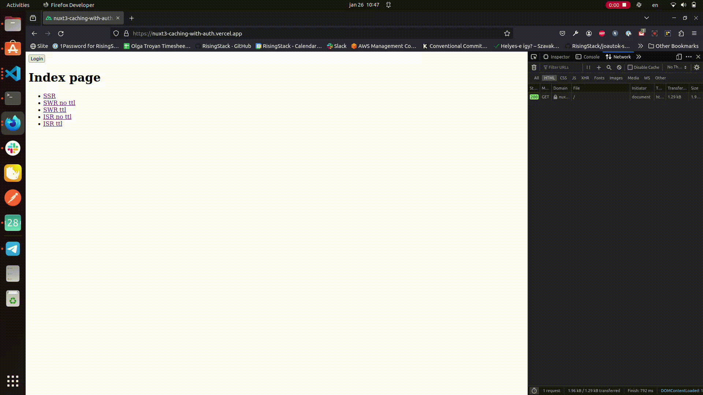

# Nuxt 3 Caching with Authentication
## Story behind
We had a project where we aimed to optimize page load times while preserving SEO benefits. One of the techniques we employed was enabling ISR (Incremental Static Regeneration), which caches the page's HTML response on the CDN network until the TTL (Time to Live) expires. However, we also encountered challenges with parts of the pages that were user-specific, such as profile data and the number of items. These components couldn't be cached, as doing so might result in one user seeing another user's items. Addressing this issue is the focus of our article

## Project setup
### Pages
The project has 5 pages with different rendering modes enabled:
1. SSR
2. ISR without TTL
3. ISR with TTL
4. SWR without TTL
5. SWR with TTL

To learn more about rendering modes in Nuxt 3, check out our blogpost [here](https://blog.risingstack.com/nuxt-3-rendering-modes/).

[Example of page code:](pages/spa.vue)
```vue
<template>
    <div>
        <p>{{ pageType }} page</p>
        <pre>Time after hydration: {{ new Date().toUTCString() }} </pre>
        <pre>Time in server rendered HTML: {{ data }}</pre>
        <NuxtLink to="/">Home</NuxtLink>
    </div>
</template>
<script setup lang="ts">
const pageType = "SSR"; // value differs based on route
const { data } = await useFetch('/api/hello')
</script>
```

### Rendering modes
Rendering modes are set up in [nuxt.config:](nuxt.config.ts)
```javascript
export default defineNuxtConfig({
  ssr: true,
  routeRules: {
    "/isr_ttl": { isr: 60 },
    "/isr_no_ttl": { isr: true },
    "/swr_ttl": { swr: 60 },
    "/swr_no_ttl": { swr: true },
  },
});
```

### Server routes
For the purpose of this showcase we simply use an object to fake a db functionality.

[dbFake.ts:](dbFake.ts)
```javascript
export const users = [
  {
    id: 1,
    loggedIn: false,
  },
];
```

Server has 4 routes:
#### api/hello
Route simply returns a current date:
```javascript
export default defineEventHandler((event) => {
  return  new Date().toUTCString();
});
```
#### api/auth
Route returns a logged in/logged out status of the first user:
```javascript
import { users } from "~/dbFake";

export default defineEventHandler((event) => {
    const loggedIn = users[0].loggedIn;
    return { loggedIn };
  });
```
#### api/login
Route updates the logged in status to `true` and returns this value:
```javascript
import { users } from "~/dbFake";

export default defineEventHandler((event) => {
  users[0].loggedIn = true;
  return { loggedIn: users[0].loggedIn };
});
```
#### api/logout
Route updates the logged in status to `false` and returns this value:
```javascript
import { users } from "~/dbFake";

export default defineEventHandler((event) => {
  users[0].loggedIn = false;
  return { loggedIn: users[0].loggedIn };
});
```

### Layout
Layout uses one header component:

[header.vue:](components/header.vue)
```vue
<template>
    <button v-if="loggedIn" @click="logout">Logout</button>
    <button v-else @click="login">Login</button>
</template>
<script setup lang="ts">
const loggedIn: Ref<boolean | undefined> = ref(false);
const { data } = await useFetch('/api/auth');
loggedIn.value = data?.value?.loggedIn;
const login = async () => {
    const response = await useFetch(
        "/api/login",
        {
            method: "PUT",
        }
    );
    loggedIn.value = response.data?.value?.loggedIn;
}
const logout = async () => {
    const response = await useFetch(
        "/api/logout",
        {
            method: "PUT",
        }
    );
    loggedIn.value = response.data?.value?.loggedIn;
}
</script>
```
This component simply renders a 'Login' button if the user isn't logged in and a 'Logout' button if the user is logged in. It includes click event handlers for each button, and these handlers call the respective API routes.

[Layout:](layouts/default.vue)
```vue
<template>
    <Header />
    <main class="main">
        <slot />
    </main>
</template>
```
### Startup
Start the example project with:
```bash
git clone git@github.com:RisingStack/nuxt3-caching-with-auth.git
cd nuxt3-caching-with-auth
pnpm install
pnpm dev
```
## User-specific data caching
If we examine our pages that should be cached with the current setup, we can observe that after logging in, upon page reload, the 'Login' button is still visible.

### SWR without TTL

The button name only updates when response changes


### SWR with TTL

The button name only updates when TTL expires

**Note** Currently this functionality is not available for showcasing with Vercel deployment as button name is never updated though otherwise this rendering mode works. We opened a customer service support ticket to address the issue.


### ISR without TTL

The button name isn't updated as ISR without TTL means page is cached permanently


### ISR with TTL

The button name only updates when TTL expires



### SSR
When examining the SSR page, it functions as expected: upon the initial page load, the 'Login' button is visible. After logging in and reloading the page, the 'Logout' button is displayed.


What is causing this? The issue stems from both SWR and ISR rendering modes caching the server-generated HTML response for the page. This implies that despite changes in the value provided by the API response, stale data persists in the browser until the TTL expires or the response changes, depending on the rendering mode.

## Solution
To prevent caching of specific parts of the layout, page, or component, we can wrap them within the [ClientOnly](https://nuxt.com/docs/api/components/client-only) component provided by Nuxt. This ensures that the particular slot is rendered only on the client side.

Let's modify the [default layout](layouts/default.vue):
```vue
<template>
    <Client-Only>
        <Header />
    </Client-Only>
    <main class="main">
        <slot />
    </main>
</template>
```

In addition, we need to modify the header component as `useFetch` used client-side does not fetch the data until hydration completes ([docs](https://nuxt.com/docs/api/composables/use-fetch#return-values)):

[header.vue:](components/header.vue)
```vue
[...]
<script setup lang="ts">
const loggedIn: Ref<boolean | undefined> = ref(false);
const { data } = await useFetch('/api/auth');
watch(() => data?.value?.loggedIn, () => {
    if (data.value) {
        loggedIn.value = data.value?.loggedIn
    }
})
[...]
</script>
```
This way we are watching for changes in the response and are updating values of `loggedIn` variable when they become available.

Upon checking the behavior now, it works as expected: any page reload after updating the user's logged-in status will render the correct values.
### SWR without TTL

The button name is up to date after a reload. The 'Time in server-rendered HTML' only updates when the response changes.


### SWR with TTL

The button name is up to date after a reload. The 'Time in server-rendered HTML' only updates when the TTL expires.

**Note** Currently, this functionality is not available for showcasing with Vercel deployment, as the button name is never updated, even though this rendering mode works otherwise. We have opened a customer service support ticket to address the issue.


### ISR without TTL

The button name is up to date after a reload. However, the 'Time in server-rendered HTML' isn't updated, as ISR without TTL means the page is cached permanently.


### ISR with TTL

The button name is up to date after a reload. However, the 'Time in server-rendered HTML' only updates when TTL expires.


## Conclusion
Utilizing a rendering mode that allows caching is excellent for achieving faster load times and reducing server costs. It can be applied even in cases where certain data on the page needs to remain up-to-date or is user-specific. This can be accomplished by wrapping the corresponding components into the <ClientOnly> component provided by Nuxt.